# 🌌 The Ultimate GitOps Kubernetes Homelab

[](https://fluxcd.io/)
[-blue?style=for-the-badge&logo=cilium)](https://cilium.io/)
[](https://istio.io/)
[](https://kubernetes.io/)
[](https://github.com/getsops/sops)

Chào mừng bạn đến với **k8s-homelab** — dự án xây dựng và quản trị hạ tầng cụm Kubernetes trên thiết bị vật lý (Bare-Metal) theo chuẩn doanh nghiệp. Dự án được vận hành hoàn toàn tự động bằng triết lý **GitOps** (thông qua **FluxCD**) và bảo mật đa tầng với **Istio Ambient Service Mesh**.

Đây không chỉ là nơi lưu trữ cấu hình, mà còn là một **cẩm nang thực tế (guideline)** dành cho những ai muốn nghiên cứu sâu về thiết kế hệ thống Cloud-Native hiện đại, tối ưu hóa mạng với eBPF, và quản lý lưu trữ phân tán.

---

## 🛠️ Trụ Cột Công Nghệ (Tech Stack)

Hệ thống được thiết kế dựa trên các công nghệ tiên tiến nhất trong hệ sinh thái CNCF:

| Phân nhóm | Logo | Công nghệ lựa chọn | Mục đích sử dụng |
| :--- | :--- | :--- | :--- |
| **GitOps Engine** |  | **FluxCD v2** | Tự động đồng bộ trạng thái từ Git vào Cluster, tự động cập nhật image. |
| **Networking & Security** |  | **Cilium (eBPF)** | CNI hiệu năng cao, định tuyến mạng không qua iptables, tích hợp L2 Announcements làm LoadBalancer. |
| **Service Mesh** |  | **Istio (Ambient Mode)** | Bảo mật mTLS sidecar-less (ztunnel), quản lý phân quyền (AuthorizationPolicy) & L7 routing qua Waypoint Proxy. |
| **Storage Layer** |   | **Longhorn / OpenEBS** | Phân cấp lưu trữ: Block storage phân tán có tính năng replication. |
| **Object Storage** |  | **Garage S3** | Lưu trữ S3-compatible dung lượng nhẹ, phân tán đa node, tối ưu cho môi trường Homelab. |
| **Database Server** |  | **CloudNative-PG** | DBaaS quản lý PostgreSQL Cluster (High Availability, auto-failover, backup/restore). |
| **Secret Management** |  | **Mozilla SOPS & AGE** | Mã hóa an toàn thông tin nhạy cảm (secrets) trực tiếp trên Git. |
| **Observability** |   | **VictoriaMetrics & Grafana** | Thu thập metric hiệu năng siêu cao, lưu trữ tối ưu hơn Prometheus truyền thống. |

---

## 🌐 Cấu Hình Mạng Multi-Cluster & Định Tuyến (Multi-Cluster Network Architecture)

Hệ thống kết nối và chuyển tiếp lưu lượng giữa cụm biên (Edge-VPS), cụm nội bộ (Homelab Bare-Metal), và mạng nội bộ (Intranet) thông qua kết nối VPN bảo mật mã hóa:

```mermaid
graph TD
    Internet[🌐 Public Internet]
    Intranet[🏠 Internal Home Network]
    
    subgraph Edge_LB ["Tầng Biên"]
        HAProxy("⚖️ HAProxy Load Balancer")
    end

    subgraph cluster_edge ["☁️ Edge-VPS Cluster"]
        Edge_GW[Gateway API / Istio Ingress]
        Edge_Apps[Edge Workloads]
        Edge_EW1[East-West Gateway]
        Edge_GW --> Edge_Apps
    end

    subgraph cluster_homelab ["🏠 Homelab Cluster (Bare-Metal)"]
        Lab_GW[Gateway API / Istio Ingress]
        Lab_Apps[Internal Workloads]
        Lab_EW2[East-West Gateway]
        Lab_GW --> Lab_Apps
    end

    %% Cổng kết nối bảo mật VPN làm trung tâm định tuyến nội bộ
    subgraph VPN ["🔒 Secure Network Link"]
        WG_Tunnel{{"WireGuard VPN Tunnel"}}
    end

    %% Định tuyến luồng Internet
    Internet --> HAProxy
    HAProxy -->|Định tuyến duy nhất| Edge_GW
    Edge_EW1 <==>|Truy cập dịch vụ Homelab nếu cần| WG_Tunnel <==> Lab_EW2

    %% Định tuyến luồng mạng nội bộ qua VPN thẳng vào Internal Ingress Gateway của Homelab
    Intranet -->|Thông qua VPN| WG_Tunnel
    WG_Tunnel -->|Truy cập dịch vụ nội bộ| Lab_GW

    %% Styling
    style HAProxy fill:#ffcc00,stroke:#333,stroke-width:2px;
    style WG_Tunnel fill:#e64a19,stroke:#fff,stroke-width:2px,color:#fff;
    style cluster_edge fill:#1d2a4a,stroke:#0066cc,stroke-width:2px;
    style cluster_homelab fill:#1a3325,stroke:#00cc66,stroke-width:2px;
```



* **Định tuyến Biên (Edge Routing):** HAProxy ở mặt trước chỉ định tuyến traffic từ Internet trực tiếp vào cụm biên Edge-VPS. Mọi truy cập từ Internet muốn tới các dịch vụ ở cụm Homelab (nếu cần thiết) bắt buộc phải đi qua Ingress của Edge-VPS, sau đó chuyển tiếp nội bộ qua kênh VPN giữa hai East-West Gateway của Istio.
* **Mạng nội bộ (Intranet Access):** Người dùng từ mạng nội bộ (Internal) truy cập trực tiếp các dịch vụ trên Homelab Cluster thông qua **WireGuard VPN Tunnel** để đi thẳng vào **Internal Gateway (Lab_GW)** trên Homelab mà không cần đi vòng ra ngoài Internet, đảm bảo an toàn tuyệt đối.
* **Kết nối Liên Cluster (Multi-Cluster Mesh):** Kênh truyền **WireGuard VPN Tunnel** kết nối thông suốt giữa các East-West Gateway của Istio, cho phép các dịch vụ ở 2 cụm giao tiếp an toàn qua mTLS như thể đang chạy trong cùng một mạng LAN.

---

## 📁 Tổ Chức Thư Mục Dự Án (Directory Layout)

Cấu trúc Repository được phân chia khoa học theo các lớp trừu tượng (Layers) giúp dễ dàng quản lý đa cluster:

```bash
├── clusters/                   # Tầng cấu hình đặc thù cho từng Cluster
│   ├── homelab/                # Cấu hình cụm Homelab chính
│   │   ├── flux-system/        # Thành phần cốt lõi của FluxCD
│   │   ├── infrastructure.yaml # Kích hoạt hạ tầng dùng chung cho cụm này
│   │   └── stacks/             # Các stack ứng dụng được kích hoạt (Staging/Prod)
│   └── edge-vps/               # Cấu hình cụm VPS biên (Edge Cluster)
│
├── infrastructure/             # Định nghĩa tài nguyên hạ tầng chung (Kustomize)
│   ├── cilium/                 # Cấu hình mạng L2 Announcement & IPAM
│   ├── istio/                  # Bộ cài đặt Istio Ambient (CNI, ztunnel, istiod)
│   ├── longhorn/               # Bộ lưu trữ khối phân tán
│   ├── garage/                 # Cấu hình cụm S3 Storage
│   └── cloudnative-pg/         # PostgreSQL Operator
│
├── sources/                    # Định nghĩa các nguồn Helm / OCI repositories bên thứ 3
│   └── helm/                   # File YAML đăng ký Helm Repository cho FluxCD
│
├── modules/                    # Thư mục chứa các module tái sử dụng (Platform Templates)
│   └── infrastructure/         # Các module giám sát (Monitor, Logging, Authen)
│
└── application/                # Chứa manifests thực tế của các ứng dụng (Workloads)
    └── website/
        └── duynch-com/         # Cấu hình deploy website cá nhân duynch.com
```

---

## 🚀 Hướng Dẫn Khởi Tạo Cụm (Bootstrap Guide)

Để khởi tạo lại hoặc cài đặt mới cụm Kubernetes dựa trên repo này, thực hiện theo các bước sau:

### 1. Cài đặt các công cụ CLI cần thiết
Đảm bảo bạn đã cài đặt các công cụ sau trên máy cá nhân:
* `kubectl`
* `flux` (FluxCD CLI)
* `age-keygen` (để giải mã SOPS)

### 2. Cấu hình Khóa Giải Mã SOPS
Tạo hoặc import khóa bí mật AGE vào cụm Kubernetes để FluxCD có quyền tự động giải mã các Secret:
```bash
cat key.txt | kubectl create secret generic sops-age \
  --namespace=flux-system \
  --from-file=keys.txt=/dev/stdin
```

### 3. Thực hiện Bootstrap FluxCD
Kích hoạt FluxCD đồng bộ với repo này (ví dụ cho cụm `homelab`):
```bash
flux bootstrap github \
  --owner=duyaccel \
  --repository=k8s-homelab \
  --branch=main \
  --path=./clusters/homelab \
  --personal
```

Sau khi chạy lệnh trên, FluxCD sẽ tự động tải các tài nguyên cần thiết, tạo các Custom Resource Definitions (CRDs) và tự động kéo toàn bộ các hạ tầng như Cilium, Istio, Longhorn, CloudNative-PG về cài đặt mà không cần bất kỳ sự can thiệp thủ công nào.

---

## 💡 Điểm Sáng Thiết Kế Kỹ Thuật (Engineering Highlights)

* **Ambient Mesh (No Sidecar)**: Không giống như thiết kế Istio truyền thống tiêm một Envoy proxy vào mọi pod, cụm lab này sử dụng **Istio Ambient mode**. Việc này giúp giảm hơn 70% mức tiêu thụ tài nguyên RAM của cụm, đồng thời loại bỏ việc phải restart lại Pod ứng dụng khi cập nhật Service Mesh.
* **Bare-metal LoadBalancer với Cilium**: Thay vì phụ thuộc vào cloud providers hoặc dùng Metallb, hệ thống sử dụng **Cilium L2 Announcement** để tự động gán các IP tĩnh từ dải mạng cục bộ (ví dụ: `192.168.10.x`) trực tiếp vào Gateway API của K8s.
* **Declarative DBaaS**: Cấu hình PostgreSQL hoàn toàn dưới dạng mã nguồn (Declarative) thông qua CloudNative-PG, hỗ trợ tự phục hồi khi có Node chết vật lý và backup tự động sang cụm S3 của Garage.

---
*Chúc bạn có những trải nghiệm tự học và khám phá vui vẻ trên cụm K8s GitOps này! Mọi đóng góp hoặc câu hỏi vui lòng mở một Issue.*
